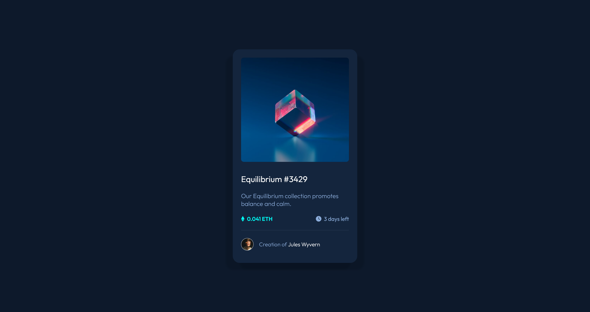
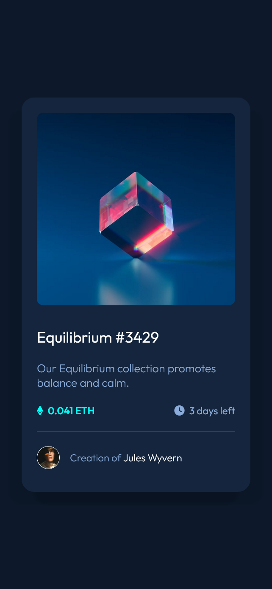

# 💵 NFT Preview Card Component

Repositório dedicado ao exercício ["NFT Preview Card Component"](https://www.frontendmentor.io/challenges/nft-preview-card-component-SbdUL_w0U) do site [Frontend Mentor](https://www.frontendmentor.io).

## 🎯Desafio

"This HTML & CSS only challenge is perfect for anyone just starting out or anyone wanting a small project to play around with."

*(Este desafio apenas em HTML e CSS é perfeito para quem está a começar ou para quem quer um pequeno projeto para brincar.)*

### ⚒️ Tecnologias utilizadas 
- HTML5
- CSS3

### 🤩 Resultado

- [Confira aqui o resultado!](https://fem-vn-nft-preview-card-component.netlify.app)

### 📸 Screenshots

  
Desktop:

  
  </img>
     

  
Mobile:

  
  </img>

